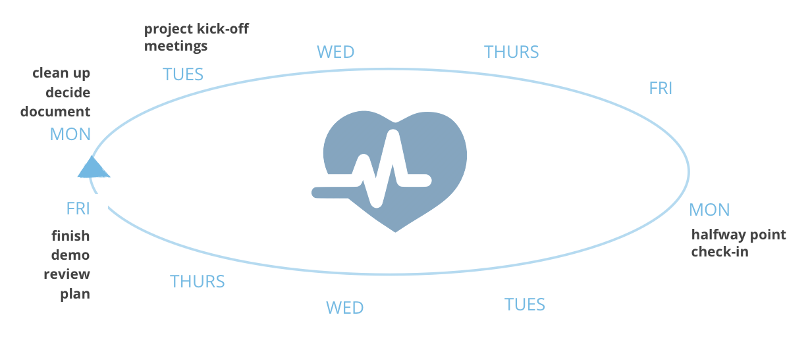
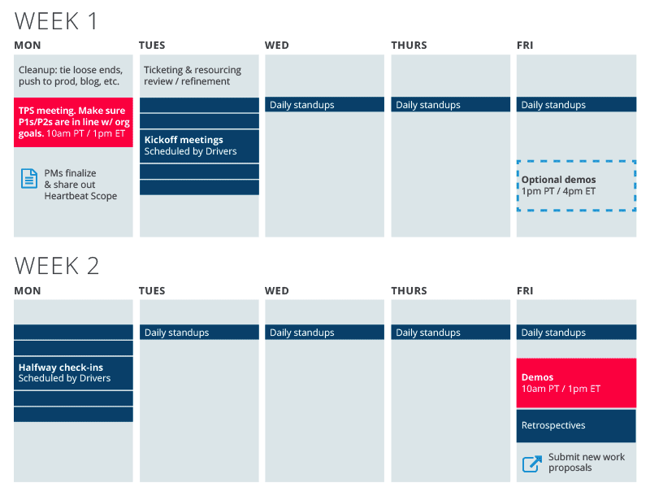

Working in two-week “Heartbeats:” how and why
============

*Webmaker is committed to working in the open, increasing our agility, and learning as we go*. To do that, we work in two-week “Heartbeats” or sprints. Here’s why:

* *Openness*. More visibility for all stakeholders. Easier to see what we’re working on. Plus: easier to get your own ideas and work into the queue.
        
* *Continuous improvement*. Move faster, work smoother, work better. 

* *Putting 2015 plans into action*. We have a solid set of quarterly milestones and a year-long plan. Heartbeats are a good way to put those plans into action — every two weeks.

* *Cross-team collaboration*. We need to co-ordinate well across all teams to succeed. With fewer meetings, red tape and collaboration cost.

* *Build on what works*. Small teams that know what they’re accountable for and have the freedom to move.

The rest of this page describes the motivation and overall flow of heartbeats.  If you just want to know how to work with heartbeats or github issues, we have two sub-chapters for that:

* [Heartbeat FAQ](heartbeat_faq.html)
* [GitHub FAQ](github_faq.html)

A typical heartbeat
-------------------

**Here’s what a typical two-week process might look like** (TL;DR version):

* *Monday*: Clean up from the last Heartbeat. Decide and prioritize what we’re doing next. Publicly share out that plan with the world.

* *Tuesday*: Project Kick-Off Meetings. Get together in small project teams around those priorities. Brainstorm, plan and whiteboard together. Make sure all the required stakeholders are on the same page.

* *2nd Monday*: half-way point. How we doing?

* *2nd Friday*: Finish line! Demo what we got done. Review what we learned. Make proposals for the next Heartbeat.

*For really important (“P1″) work*: layer on daily 15-minute stand-ups. To make sure questions and problems get answered fast.

*That’s it!* Layer on whatever other meeting, communicating and dance parties required. Rinse and repeat.

# Heartbeat Process

*Here’s the more detailed version of that same process:*

## Week 1

### Mon

* *Clean up*. Tie off any loose ends from previous week. Push to production, write blog posts or documentation, communicate out, etc.

* *TPS meeting*. TPS meets to review heartbeat proposals. Communication and horse-trading happens. TPS sets priorities for the heartbeat: P1 / P2 / don’t do.

* *Publicly document and share priorities*. At build.webmaker.org/now. This is the finalized set of priorities for the Heartbeat. It’s publicly visible, shareable, and always up to date. Plus includes owners and roles for each project.

### Tues

* *Kick-off meetings.* Project owners and teams get together to plan and communicate up front. Co-leadership, consultation and white-boarding happen. Good kick-off meetings are essential; here’s a template we can edit together to make them awesome.

* *Ticketing*. All tasks are created as tickets and assigned.

* *Resourcing*. Review for bottlenecks. Who’s got too much on? Who can help?

### Wed – Fri

* *Daily stand-ups*. On all P1s. 15 mins max. Status check: red, yellow, green. All issues with the “needs discussion” label are reviewed together as a team.

## Week 2

### Mon

*Halfway point*. Project teams meet to review progress. Reality-check. Includes a check-in for each team member about the issues assigned to them. What adjustments do we need to make?

### Tues – Thurs

*Daily stand-ups*. (Same as previous.)

### Friday

* *Demo*. Cross the finish line together. Review completed work, including all P1s. All interested stakeholders (that means you!) are welcome to attend — it’s a chance to see what we got done together. (note: new time for demos = 11am PT / 1pm ET)

* *Retrospective*. Together and in small teams. What are your personal highlights from the past two weeks? Something you’re proud of? Something that was hard? What’d you learn that you commit to address next time around?

* *Proposals*. Plan for next Heartbeat. Given the milestones we’ve set together for the quarter, where should we focus next? Some structure and planning will already exist — but take the afternoon to review, consult with colleagues and make proposals.

# New tools and dashboards

New project intake process. Anyone is able to propose a piece of work at [build.webmaker.org/add](https://build.webmaker.org/add). It guides you through a project intake process and template that will help us put distributed leadership into action.

See what we’re working on. This new site: [build.webmaker.org/now](https://build.webmaker.org/now) shows our priorities for the current heartbeat. Plus what’s been proposed so far for the next one.

Using GitHub issues. Moving forward, we are embracing GitHub issues in place of Bugzilla for much of our work. Of course, we’ll continue to use and support both. We think you’ll like the GitHub interface and ways to make the work more visual. And we’re offering Git Hub issues training to anyone who wants it. Also: feel free to ask in #webmaker IRC any time you’ve got questions. We’re all noobs. We’re all learning together.

Fewer, better meetings
======================

Demos. We’re changing how and when we do demos. We’ll do them every other Friday, add the end of each heartbeat, at 1pm ET / 10am PT / 6pm GMT. The goal: add weight and ritual, and add emphasis to what we’ve accomplished each heartbeat. Note: *all* P1s will be expected to demo.

Daily standups on P1s. Stand-ups are quick, 15-minute check-ins. They start *precisely* on time, and are designed to carefully respect your time. These ensure you get any help and answers you need quickly.

Project Kickoff meetings are an art. They’re a big part of distributed leadership, collaboration and minimizing headaches. There’s more detail on tips and tricks for Kick-off Meetings coming soon.

