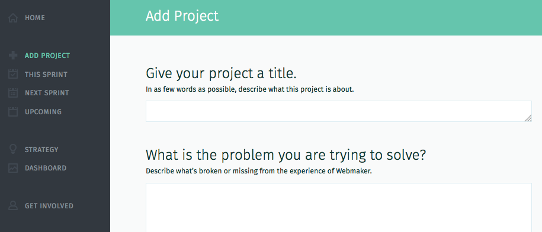
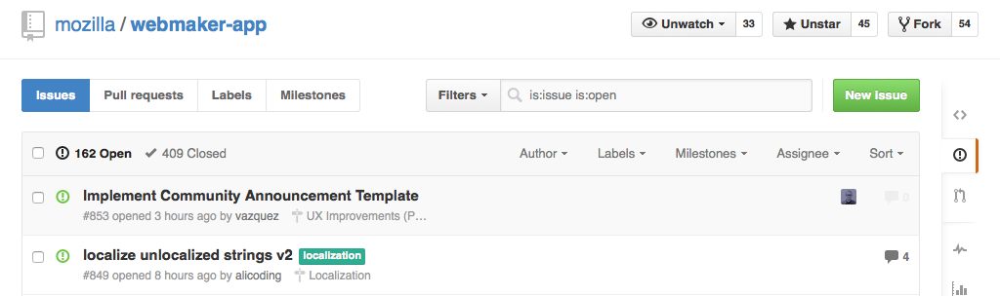

# More GitHub Tips

## How to create a ticket 

At MoFo, we have two kinds of tickets.  The run-of-the-mill GitHub issue, and the MoFo-only, **"meta" planning issue**.  The latter is used to say "Hey, we need this big new bit of work done, let's schedule it". The former is used to say things like "This page needs that picture changed to be happier."

1. To file a meta issue, use the [bespoke form](http://build.webmaker.org/add) we built just for that purpose.  It'll make sure your ticket is as complete as possible without being boring: 

2. To file a regular issue, find the repo that is most likely relevant, click on the issues icon in the right, then click on the green New Issue button

It's easy to create a ticket! 

1. Just click the green "new issue" button.
2. Give it a title. Something clear, descriptive and actionable. (e.g., "Ship new documenation for build.webmaker.org" is better than "documentation" or "document all the things!!!! :p"
3. Assign someone if you have someone in mind. Otherwise just leave it blank.
4. Describe it. Fill out the comment field to describe what needs doing, fixing, documeting, deciding, etc. 
5. Hit "Submit new issue." That's it! You're done. 

## Styling and formatting your comments. 

You  can also include fancier stuff in your tickets -- like text styling, to-do   lists with check boxes, and emoji's using Markdown. These guides  explain  how: 
https://guides.github.com/features/mastering-markdown/
http://www.emoji-cheat-sheet.com/

You can also add images by just dragging and dropping them right into the comment box. Easy! 

This article from github describes how they think about language in issues: https://github.com/blog/1943-how-to-write-the-perfect-pull-request)

## How to "CC" or flag someone on a ticket

In Bugzilla you CC people. And if you really want to get their attention or ask them a question, you flag them with "needinfo."

In GitHub issues, it's different: you don't add people to a "CC" field, or "flag" them. You just "mention" them in a comment. The convention for mentioning someone is simple: just use @username.  (For example, /cc @cassie, @OpenMatt, @foo). Mentioning someone, like: "@OpenMatt:  when are you planning to ship that blog post?" is the best way to get  someone's attention.

This cheat sheet explains this and some other Bugzilla equivalents for Git Hub issues: http://cl.ly/ZF9a

(We're working on adding a feature to build.webmaker.org to help manage mentions.  See [this prototype](http://plzkthx.herokuapp.com/) and talk to DavidA if you have feedback.

## How to use labels

Labels are like tags that help you find and group tickets. You can use labels however you like. Make up your own for whatever helps you get stuff done. (e.g., "MozFest," "badges," etc.) We're going to document our conventions around using labels soon  -- don't worry about getting it perfect. Some common labels we use are:

* Priority.  We label "p1" or "p2" to indicate prioritization. p1 means must ship  this Heartbeat. p2 means it's less important, we do it if we have time. The planning group assigns the p1/p2 labels at the beginning of the heartbeat.  Don't change them without their OK please.
* "critical" = a really bad bug, needs immediate attention
* Resourcing. If a ticket needs design or dev resources, for example, we'll label it "needs-dev" or "needs-design." 
* help-wanted - This label means that this ticket involves work that's good for community contributors. 
* assigned-to-contributor - A ticket being worked on by a community contributor. 

More on our label conventions and process coming soon: https://github.com/MozillaFoundation/plan/issues/194

Create a new label. Here's how to create new label for the "plan" repo:
https://github.com/MozillaFoundation/plan/labels

How to use milestones
====

Setting milestones by Heartbeat
----
We typically work in two-week "Heartbeats" [more on this here]. To indicate that a ticket is part of a particular Heartbeat, we use the   "milestone" field. So for example, the milestone might be:

* Jan30
* Feb13
* Feb27, etc.

Making sure you have the right permissions to use labels and milestones. To use labels and milestones, you need to have the right permissions.  If you find yourself unable to add labels, and you'd like to, file a ticket here: [link] 

QUESTION: Simon: should we just make everyone added to mozillafoundation organization a contributor by default? 

QUESTION: Simon: Can you set up new ticket links that automatically label, assign the right ticket? 
